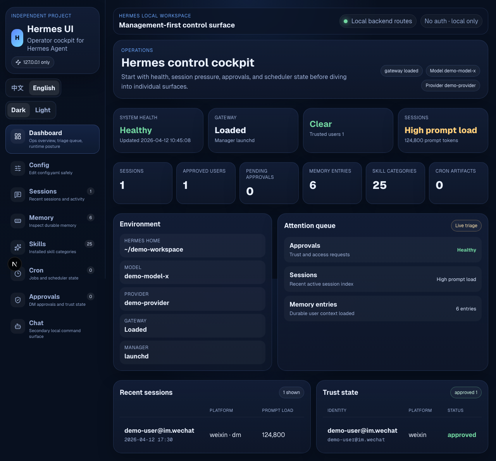
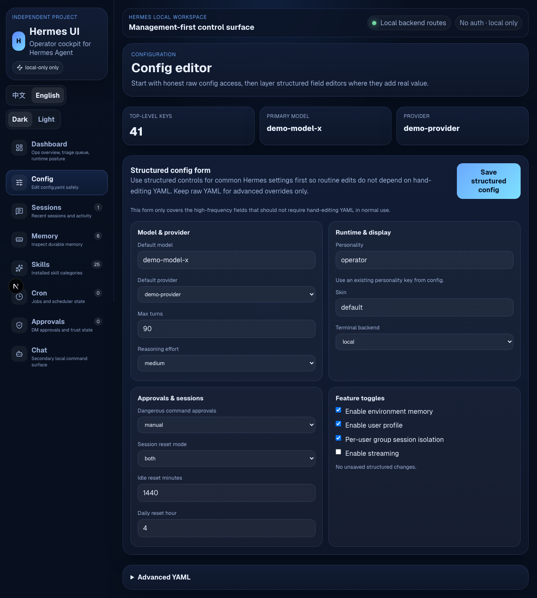
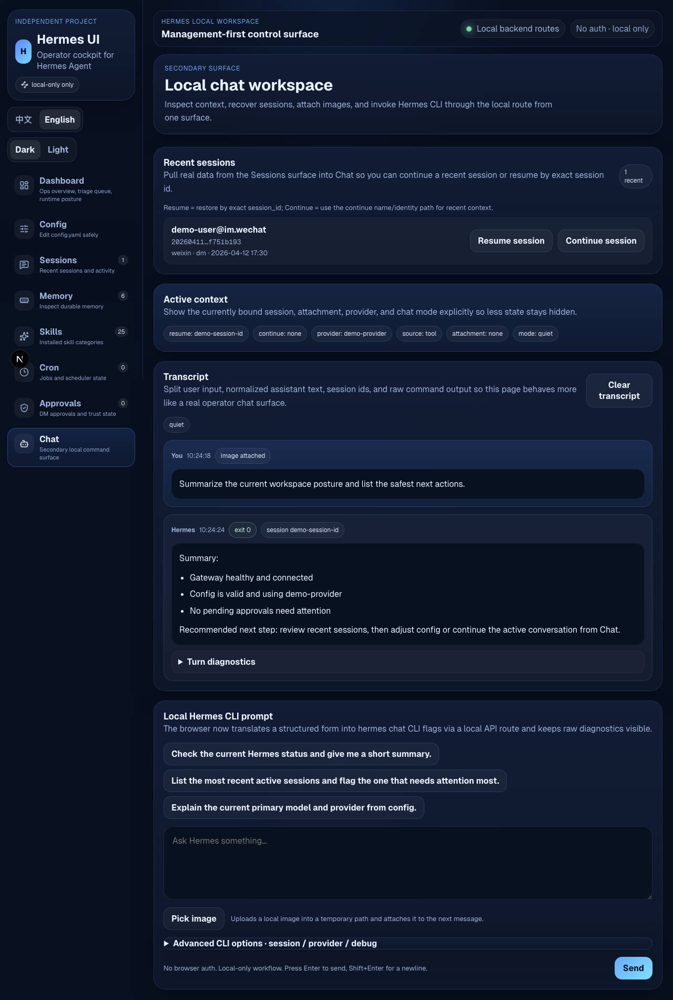
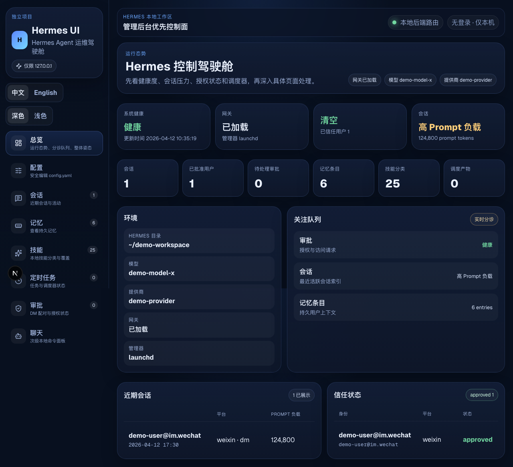
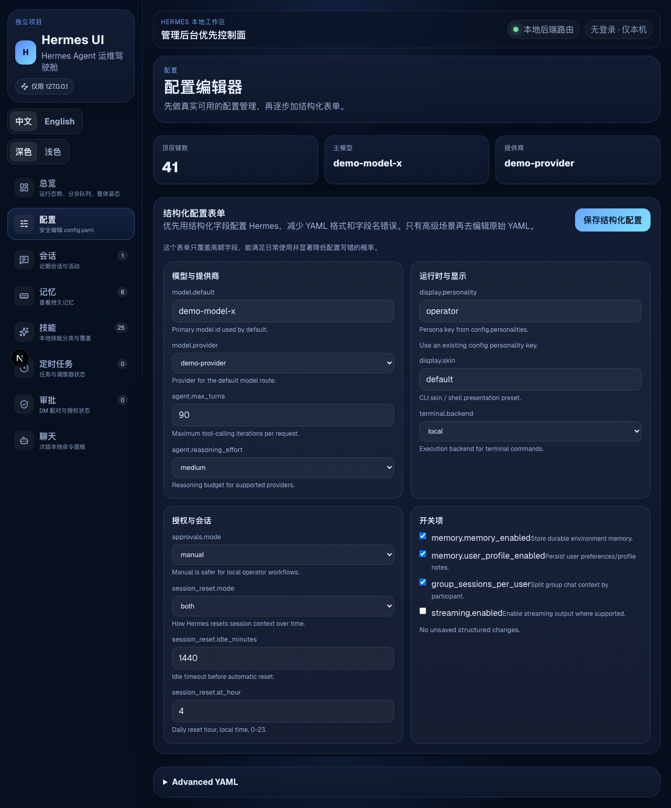
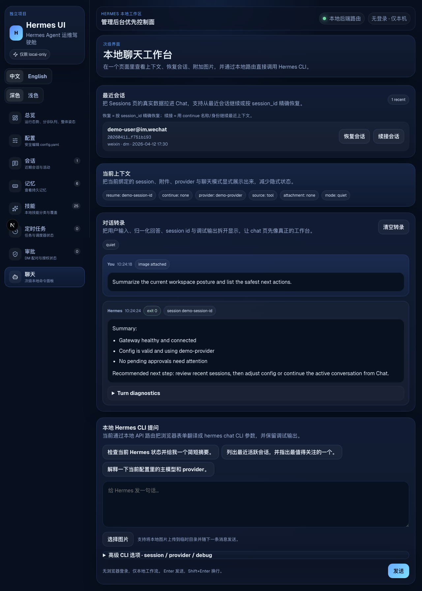

# hermes-ui

Independent management-first web UI for Hermes Agent.

This project is intentionally separate from the official Hermes repository. It is designed as a local operator cockpit first, with chat as a secondary surface.

Current goals:
- management-first dashboard
- structured config editing instead of raw YAML by default
- session browsing and inspection
- memory / skills / cron / approvals visibility
- bilingual UI (中文 / English)
- dark / light themes

## Status

Work in progress, but already functional.

Implemented pages:
- Dashboard
- Config
- Sessions
- Memory
- Skills
- Cron
- Approvals
- Chat

## Screenshots (English UI)

All screenshots below are intentionally redacted before publishing. Real local paths, personal identifiers, session ids, and account-specific values have been replaced with demo placeholders.

### Dashboard



### Structured config editor



### Chat workspace



## Tech stack

- Next.js
- React
- TypeScript
- react-hook-form

## Local development

```bash
cd ~/Projects/hermes-ui
npm install
npm run dev -- --hostname 127.0.0.1 --port 3007
```

Open:
- http://127.0.0.1:3007/dashboard
- http://127.0.0.1:3007/config
- http://127.0.0.1:3007/sessions

## Data sources

This UI reads from your local Hermes installation and local Hermes CLI.

Examples:
- `~/.hermes/config.yaml`
- `~/.hermes/sessions/sessions.json`
- `~/.hermes/memories/USER.md`
- `~/.hermes/pairing/*.json`
- `~/.hermes/skills/`
- `hermes cron status`
- `hermes cron list`
- `hermes chat -q ...`

## Product direction

This project currently follows these principles:
- operator console first
- safer structured config editing first
- raw YAML only as an advanced path
- local-first, no-auth default
- real browser-based UI/UX audit loop before publishing

## Known limitations

- Config editing only covers the most common fields in structured form today.
- Advanced YAML is still needed for unsupported settings.
- Sessions page is still early and needs richer triage actions.
- Cron and approvals pages are visibility-first, not full workflow consoles yet.
- No authentication layer yet; local-only usage is assumed.

## Near-term roadmap

- stronger field validation and save feedback in Config
- richer triage actions in Sessions
- better anomaly explanation and operational severity modeling
- more complete operator workflows for Cron / Approvals / Memory
- GitHub release once UI passes repeated audit loops

---

## 中文说明

独立的 Hermes Agent 管理优先 Web UI。

这个项目刻意保持与 Hermes 官方仓库分离，优先服务本地运维/操作者工作台，而不是把聊天做成首页主入口。

当前目标：
- 管理优先的 Dashboard
- 结构化配置编辑优先，原始 YAML 作为高级入口
- 会话浏览与检查
- Memory / Skills / Cron / Approvals 可视化
- 中英文 UI
- 深浅色主题

### 中文界面截图

以下截图在发布前都做了脱敏处理。真实本地路径、个人标识、session id 和账号相关值都已经替换为 demo 占位符。

#### Dashboard



#### 结构化配置页



#### 聊天工作台


